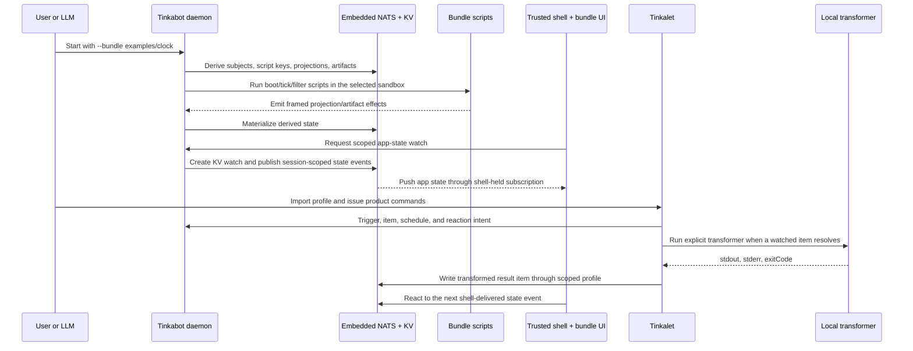

# Tinkabot

Tinkabot runs generated automation as software without handing raw authority to
the generated code. A generated app is a bundle: plain backend processes emit
framed effects on stdout, frontend files are served as sandboxed artifacts, and
the trusted substrate decides what can trigger, write, read, and observe.

The substrate is a single Go binary with embedded NATS, operator/JWT auth, a
trusted browser shell, mediated script execution, and bundle sandboxing through
Bubblewrap. Generated code never receives NATS credentials or store handles.

## Concept

Tinkabot is the server authority. It owns embedded NATS, durable material,
derived permissions, script execution, sandboxing, and the trusted shell.
Tinkalet is the edge tool. It imports a Tinkabot profile and lets humans,
scripts, CI, or local agents trigger app behavior, create or wait on durable
items, register reactions, and run explicit local transformers without speaking
raw NATS.

A bundle is the app delivery unit: one folder contains the backend scripts,
manifest wiring, and frontend artifacts or artifact emitters. Bundle scripts
emit framed effects; Tinkabot validates them and writes NATS-backed projections
and artifacts. The UI observes those derived materials through the trusted
shell, so generated frontend code renders state but does not receive
credentials.



## Staple Demo

From a source checkout, run the executable version of that sequence:

```bash
bun run demo:chain
```

The script builds a release-shaped package, starts packaged `tinkabot` with the
clock bundle, retunes that bundle's clock cadence to `100ms` through the config
bucket for a realtime sync probe, imports the local profile with packaged
`tinkalet`, removes the packaged NATS CLI sidecar before issuing Tinkalet
commands, triggers the clock, registers a local transformer reaction, resolves a
source item, verifies the transformed result item, sets a server-owned schedule,
verifies the scheduled item tick, and then turns the schedule off. When
Tailscale is available, the script keeps Tinkabot on loopback, opens a
short-lived Tailscale forwarder for the shell, prints and verifies the MagicDNS
URL, and uses loopback for its own internal assertions. Set
`TINKABOT_DEMO_PUBLIC_HOST` to override the shown host, and set
`TINKABOT_DEMO_FAST_EVERY` to another duration or `manifest` to skip the demo
cadence override.

To measure the browser-visible sync envelope of the same chain, enable the
browser probe:

```bash
TINKABOT_DEMO_BROWSER_SYNC=1 TINKABOT_DEMO_FAST_EVERY=100ms bun run demo:chain
```

The probe opens the Tailscale/MagicDNS clock URL when available, samples the
generated page's DOM, and writes `realtime-browser-sync.json` beside the demo
artifacts. It checks browser age p95/p99, filter p95, and source interval p95.
It is a freshness proof for the latest projection, not an event-loss or
participant-throughput claim.

For show-and-tell, keep the shell open after the proof:

```bash
TINKABOT_DEMO_HOLD=1 bun run demo:chain
```

For a Vite-style patching tour, run:

```bash
bun run demo:patch
```

That script shows the integration from three viewpoints. Tinkabot starts the
builder bundle and owns the reaction chain. Tinkalet imports the local profile
that Tinkabot wrote into the store and selects it as the active edge profile.
The caller then triggers `bundle.builder.source`; the hidden
`tb.bundle.builder.source` subject is derived inside the trusted substrate, and
the already-open browser app refreshes from the updated built projection.

For the turn-based participant proof, run:

```bash
bun run demo:turn
```

That script starts packaged `tinkabot` with `--participant demo:alice` and
`--participant demo:bob`, imports owner and participant profiles with packaged
Tinkalet, disables the packaged NATS CLI sidecar, then completes a small
turn-based sequence using only `tinkalet item`, `tinkalet action submit`,
`tinkalet action apply`, and `tinkalet action reject`. The proof covers legal
completion plus wrong-turn, duplicate, stale-revision, and occupied-cell
denials as NATS-backed item material. The board rules live in the demo logic;
the platform surface stays generic.

For the real two-player chess app, run:

```bash
bun run demo:chess
```

That script builds the release archive, starts packaged `tinkabot` with
`demo:alice` and `demo:bob`, exposes the trusted shell through Tailscale, opens
two browser pages, and drives a real chess board through browser-origin
`participant_action` messages. The app reducer consumes those actions from
`tinkalet watch prefix`, uses `chess.js` for move legality and checkmate
rules, and materializes the result through `tinkalet action apply` or
`tinkalet action reject`. The proof requires a chess-only page, 64 rendered
squares, board-scoped read denial, invalid move denials, no raw browser NATS
authority, no generated-frame polling, pushed-state latency under the product
budget, and no chess-specific platform API. Polling is measured from the trusted
shell command-dispatch log, not from a generated-frame self-report.

For manual play, keep the two links open:

```bash
TINKABOT_DEMO_HOLD=1 bun run demo:chess
```

Open the printed Alice and Bob Tailscale links, enter a name on each page, keep
the shown board code unchanged, and play both sides. The first join becomes
white; the second join becomes black. The demo creates that board code before
printing the links; arbitrary board creation from the browser is not part of
this proof.

For the anonymous typeracing app, run:

```bash
bun run demo:typerace
```

That script builds the release archive, starts packaged `tinkabot` with two
opaque `anon-*` participant profiles, exposes the trusted shell through
Tailscale, opens two browser pages, and drives a race through browser-origin
`participant_action` messages. The app reducer consumes those actions from
`tinkalet watch prefix`, computes progress and winner from the shared prompt,
and materializes race state through `tinkalet action apply` or
`tinkalet action reject`. The proof requires a typeracing-only page, anonymous
scoped users, participant-escape and stale/duplicate/late-action denials, no raw
browser NATS authority, no generated-frame polling, pushed-state latency under
the product budget, and no typeracing-specific platform API.

For manual anonymous play, keep the race links open:

```bash
TINKABOT_DEMO_HOLD=1 bun run demo:typerace
```

Open the printed anonymous runner Tailscale links, click Join in both pages,
then type the shared prompt. The demo creates the race code before printing the
links; arbitrary public lobby creation from the browser is not part of this
proof.

For the realtime participant reference proof, run:

```bash
bun run demo:realtime
```

That script starts packaged `tinkabot` with the same derived participant
profiles, disables the packaged NATS CLI sidecar before user-level commands,
then drives a fast two-participant action stream through packaged Tinkalet. It
verifies each participant's own filtered watch sees every expected action,
materializes an authoritative terminal result under `apps.demo.state.terminal`,
rejects a late action without mutating the final state, and writes
`realtime-reference-proof.json`. This proves the packaged realtime substrate
path; browser-originated participant actions remain a separate bridge.

For the multitenant isolation concurrency proof, run:

```bash
bun run demo:iso-concurrency
```

That script starts one packaged Tinkabot daemon with `demo` and `other` app
scopes and four participant profiles, disables the packaged NATS CLI sidecar
before user-level commands, and drives concurrent action streams through
packaged Tinkalet. It verifies own-scope watches, cross-app and neighbor
denials, same-store restart, cursor catch-up, duplicate replay timeout, and
writes `iso-concurrency-proof.json` with observed action rate and latency
metrics. The proof is observed-only; it does not claim a maximum capacity.

For the LLM visualization decision loop, run:

```bash
bun run demo:visual
```

That script builds the release archive, starts packaged `tinkabot` with the
clock bundle and a scoped `llm` watcher profile for
`artifacts.artifact-browser.results.choice`, exposes the trusted shell through
Tailscale when available, verifies the rendered bundle artifact, and drives a
generated visual page. The page receives only a leased `item_submit` command,
submits the selected choice, and never receives NATS credentials. Packaged
Tinkalet imports owner and watcher profiles into separate local environments;
the watcher can observe the exact result item but cannot direct-read, broaden to
a prefix, or switch to owner authority. The proof also triggers the clock
transform chain and restarts Tinkabot on the same store to verify the submitted
result remains durable NATS-backed material.

## Quick Start

Current release channel: GitHub Release archive:

```bash
curl -LO https://github.com/lagz0ne/tinkabot/releases/download/v0.1.1/tinkabot-v0.1.1-linux-amd64.tar.gz
curl -LO https://github.com/lagz0ne/tinkabot/releases/download/v0.1.1/tinkabot-v0.1.1-linux-amd64.tar.gz.sha256

sha256sum -c tinkabot-v0.1.1-linux-amd64.tar.gz.sha256
tar -xzf tinkabot-v0.1.1-linux-amd64.tar.gz
cd tinkabot-v0.1.1-linux-amd64
./tinkabot --version
./tinkalet --version
```

Run directly from the unpacked package:

```bash
./tinkabot --store /tmp/tb-clock --shell 127.0.0.1:8419 --bundle examples/clock
```

Open:

```text
http://127.0.0.1:8419/artifacts/bundle/clock/index.html
```

The package includes `tinkalet` for profile-aware product commands,
`libexec/tinkabot/bwrap` for sandboxing, and `libexec/tinkabot/nats` for
operator diagnostics.

To put `tinkabot` on `PATH`, keep the package directory intact and symlink the
binary:

```bash
mkdir -p ~/.local/opt ~/.local/bin
mv tinkabot-v0.1.1-linux-amd64 ~/.local/opt/
ln -sfn ~/.local/opt/tinkabot-v0.1.1-linux-amd64/tinkabot ~/.local/bin/tinkabot
ln -sfn ~/.local/opt/tinkabot-v0.1.1-linux-amd64/tinkalet ~/.local/bin/tinkalet
tinkabot --version
tinkalet --version
```

This layout matters: the binary discovers bundled sidecars relative to itself
or its symlink target. A plain `go install` only installs the Go executable and
does not install the sandbox, NATS CLI sidecar, examples, or release metadata.

## Source Checkout

Prereqs for a source checkout:

- Go matching `substrate/go/go.mod`
- Bun
- Bubblewrap (`bwrap`) on Linux for sandboxed bundles

Build a local release-shaped package:

```bash
bun install
bun run pack:tinkabot /tmp/tinkabot
```

Run the clock bundle:

```bash
/tmp/tinkabot/tinkabot \
  --store /tmp/tb-clock \
  --shell 127.0.0.1:8419 \
  --bundle examples/clock
```

Open:

```text
http://127.0.0.1:8419/artifacts/bundle/clock/index.html
```

Runtime lookup order for Bubblewrap is `TB_BWRAP`, then the bundled sidecar,
then `PATH`; sandbox preflight still fails closed if the host cannot run
Bubblewrap namespaces. For a trusted local demo on a host without working
Bubblewrap, add `--bundle-sandbox none`.

Build a GitHub-Release-shaped archive:

```bash
bun run release:package dist/release
```

## Drive It

The binary writes a local profile descriptor into the store on startup.
Tinkalet imports that descriptor, copies the caller credential into its managed
data dir, and then speaks product intent instead of raw NATS subjects:

```bash
TINKALET_CONFIG_DIR=/tmp/tinkalet-config \
TINKALET_DATA_DIR=/tmp/tinkalet-data \
  ./tinkalet profile import local --store /tmp/tb-clock --name local

TINKALET_CONFIG_DIR=/tmp/tinkalet-config \
TINKALET_DATA_DIR=/tmp/tinkalet-data \
  ./tinkalet profile use local

TINKALET_CONFIG_DIR=/tmp/tinkalet-config \
TINKALET_DATA_DIR=/tmp/tinkalet-data \
  ./tinkalet trigger bundle.clock.tick --request-id req-clock-1
# -> profile local accepted bundle.clock.tick

TINKALET_CONFIG_DIR=/tmp/tinkalet-config \
TINKALET_DATA_DIR=/tmp/tinkalet-data \
  ./tinkalet schedule set heartbeat --every 1s --write demo/heartbeat --value '{"kind":"heartbeat"}'
# -> schedule heartbeat active every 1s -> demo/heartbeat
```

The clock also ticks itself every five seconds by default. Use it as a bundle
and Tinkalet tour. For browser realtime app-state proof, use `bun run
demo:chess` or `bun run demo:typerace`: the trusted shell holds the NATS
subscription, generated UI receives realtime state updates as leased
`tinkabot.state` messages, and each proof records zero generated-frame state
reads from the shell dispatch log.

The bundled NATS CLI sidecar remains useful for diagnostics and advanced
operator checks, but the clock trigger tour does not require a global `nats`
install or raw subject names.

When the builder bundle is running with `--store /tmp/tb-builder`, use the same
profile import/use flow against that store, then trigger its source entry:

```bash
TINKALET_CONFIG_DIR=/tmp/tinkalet-config \
TINKALET_DATA_DIR=/tmp/tinkalet-data \
  ./tinkalet profile import local --store /tmp/tb-builder --name local

TINKALET_CONFIG_DIR=/tmp/tinkalet-config \
TINKALET_DATA_DIR=/tmp/tinkalet-data \
  ./tinkalet profile use local

TINKALET_CONFIG_DIR=/tmp/tinkalet-config \
TINKALET_DATA_DIR=/tmp/tinkalet-data \
./tinkalet trigger bundle.builder.source --request-id req-builder-1
# -> profile local accepted bundle.builder.source
```

To admit scoped app participants at startup:

```bash
./tinkabot \
  --store /tmp/tb-turn \
  --shell 127.0.0.1:8419 \
  --participant demo:alice \
  --participant demo:bob
```

Each participant gets a local profile descriptor under
`/tmp/tb-turn/participants/<app>/<id>`. A participant imports its own descriptor
and submits actions against the shared state revision:

```bash
TINKALET_CONFIG_DIR=/tmp/tinkalet-alice-config \
TINKALET_DATA_DIR=/tmp/tinkalet-alice-data \
  ./tinkalet profile import local --store /tmp/tb-turn/participants/demo/alice --name alice

TINKALET_CONFIG_DIR=/tmp/tinkalet-alice-config \
TINKALET_DATA_DIR=/tmp/tinkalet-alice-data \
  ./tinkalet profile use alice

TINKALET_CONFIG_DIR=/tmp/tinkalet-alice-config \
TINKALET_DATA_DIR=/tmp/tinkalet-alice-data \
  ./tinkalet action submit a1 \
    --state apps.demo.state.board \
    --base-revision 1 \
    --value '{"cell":"a1"}'
```

The owner or reducer profile reads the pending action and writes the result:

```bash
./tinkalet action apply apps.demo.participants.alice.actions.a1 \
  --value '{"turn":"bob","cells":{"a1":"alice"}}'

./tinkalet action reject apps.demo.participants.bob.actions.b-wrong-turn \
  --reason wrong-turn
```

`action apply` claims the deterministic receipt key, mutates the shared state
with KV compare-and-set, then updates the receipt to resolved. `action reject`
writes a denied receipt without mutating state. Both commands reject participant
profiles and both are keyed by the deterministic `<action-key>.receipt` item.
Rejection reasons are lowercase tokens such as `wrong-turn` or `occupied-cell`.

## What Is Proven

- **Authority is derived.** A bundle manifest names local entries and local
  projections; the substrate derives script keys, trigger subjects, projection
  ids, and artifact paths.
- **Effects are mediated.** Scripts emit framed JSON effects; the substrate
  validates policy before writing projections or artifacts.
- **Generated UI is sandboxed.** Bundle pages are served under the trusted shell
  as untrusted artifacts.
- **Bundles are isolated.** Bundle state lives in its own runtime-minted NATS
  account; the app account observes only through explicit exports/imports.
- **Sandboxing is fail-closed.** The default bundle tier requires Bubblewrap
  preflight before generated processes run.
- **Operator proof is reproducible.** Packages include the pinned NATS CLI
  sidecar used by the source checkout's `tools/natscli` proof path.

## Checks

```bash
bun run gate:manual
bun run release:evidence
bun run release:package dist/release
bun run demo:chain
bun run demo:chess
bun run demo:typerace
bun run smoke:tinkalet-package
cd substrate/go && go test ./... -count=1
```

`gate:manual` runs the manual's documented command/outcome pairs against a real
binary using the pinned NATS CLI tool. `smoke:tinkalet-package` builds the
release archive, runs the packaged `tinkabot`, imports its local profile with
the packaged `tinkalet`, removes the packaged NATS sidecar, and still triggers
the clock. `demo:chain` is the operator-facing tour for bundle UI, Tinkalet
profile commands, local transformer reactions, and Tinkabot-owned schedules.
With `TINKABOT_DEMO_BROWSER_SYNC=1`, `demo:chain` also opens the Tailscale clock
URL in Playwright and writes a JSON browser-sync proof for the generated page.
`demo:patch` is the Vite-style live patch tour: it runs the builder bundle,
imports and selects its local profile with packaged Tinkalet, disables the
packaged NATS CLI sidecar, opens Chromium through the shown shell URL, triggers
a source rebuild through `tinkalet trigger bundle.builder.source`, and verifies
the already-loaded browser app refreshes from the updated projection/artifact.
`release:evidence` validates the release manifest and gate results.

## Examples

- [examples/clock](examples/clock/README.md): smallest complete bundle. A shell
  script emits state and a page; a long-lived filter derives the view consumed
  by the frontend.
- [examples/builder](examples/builder/README.md): advanced bundle. A source
  script emits a tiny Vite app; a Bun/Vite filter rebuilds artifacts when the
  source projection changes, and the open browser app refreshes from the built
  projection.

## Repository Map

- `substrate/go`: Go binary, embedded NATS, auth, bundle runtime, sandboxing
- `examples`: release-shaped bundle examples
- `docs/manual/v1.md`: operator manual and command surface
- `release/v1.json`: release evidence manifest
- `tools/natscli`: pinned NATS CLI Go tool used by proofs
- `packages/sdk`, `schemas/base/v1`: shared contract surface
- `apps/frontend`: trusted browser shell
- `docs/matched-abstraction`: design, plan, and task evidence

## License

MIT. See [LICENSE](LICENSE).

## Current Limits

- No npm wrapper yet; `bun run release:package` creates the GitHub Release
  archive locally. Symlink `tinkabot` and `tinkalet` from that archive for now.
- Default bundle sandboxing depends on host support for Bubblewrap namespaces.
- The browser shell is functional proof infrastructure, not a polished product
  UI.
- HA and multi-node operation are contract-shaped, not production-operated.
